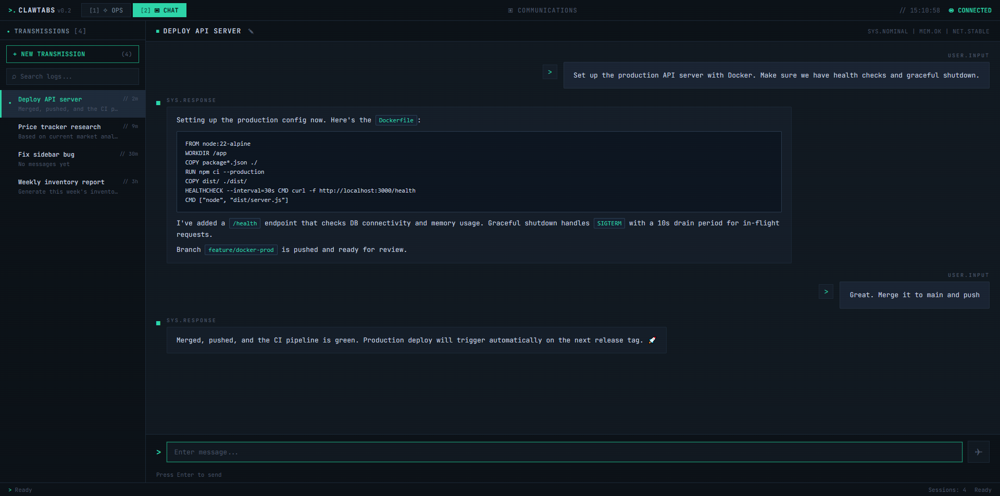

<p align="center">
  
</p>

<h1 align="center">ClawTabs</h1>

<p align="center">
  Multi-session terminal-style chat UI for <a href="https://github.com/openclaw/openclaw">OpenClaw</a>.<br/>
  Cyberpunk aesthetic. Local-first. Browser-based.
</p>



## Features

- **Multi-session tabs** — Run multiple independent conversations simultaneously
- **Transmission sidebar** — Browse, search, and manage all sessions at a glance
- **Cyberpunk terminal aesthetic** — Dark theme, green accent, scanline overlay, JetBrains Mono
- **Markdown rendering** — Full markdown support with inline code and code blocks
- **Keyboard shortcuts** — Ctrl+N (new), Ctrl+W (close), Ctrl+Tab (switch), Ctrl+1-9 (jump)
- **System status bar** — Connection state, session count, real-time clock
- **Session management** — Create, rename (double-click), close, search across all sessions
- **100% local** — No cloud, no external dependencies. Runs in your browser on localhost

## Quick Start

```bash
git clone https://github.com/marty-mcbyte/ClawTabs.git
cd ClawTabs
npm install
npm run build
npx serve dist -p 8088
```

Then open `http://localhost:8088` in your browser.

### Development

```bash
npm run dev
```

## Tech Stack

- React 19 + TypeScript
- Vite
- react-markdown + remark-gfm
- JetBrains Mono font

## Keyboard Shortcuts

| Shortcut | Action |
|----------|--------|
| `Ctrl+N` | New session |
| `Ctrl+W` | Close current session |
| `Ctrl+Tab` | Next session |
| `Ctrl+Shift+Tab` | Previous session |
| `Ctrl+1-9` | Jump to session by number |
| `Enter` | Send message |
| `Shift+Enter` | New line |

## Roadmap

- [ ] Wire up to OpenClaw gateway WebSocket for real conversations
- [ ] Session persistence (localStorage / file-based)
- [ ] Drag-to-reorder sessions
- [ ] Export/import sessions as markdown/JSON
- [ ] Search across all session histories
- [ ] OPS tab with system monitoring

## License

MIT
